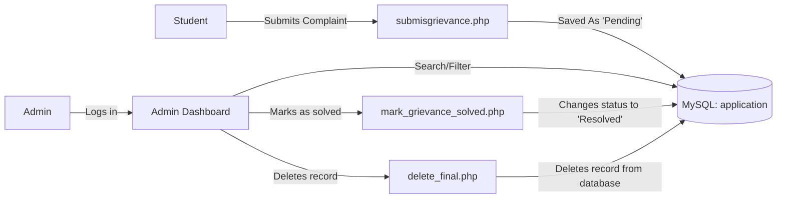

# SRM University Student Complaints & Grievance Redressal System

[](https://www.php.net/)
[](https://www.mysql.com/)
[](https://getbootstrap.com/)
[](LICENSE)

Web portal for registering and redressing university department-level grievances from students and allowing administrative personnel to log, manage and resolve complaints with complete auditing.

---

## Table of Contents

- [Key Features](#-key-features)
- [Workflow & Architecture](#-workflow--architecture)
- [Project Structure](#-project-structure)
- [Getting Started](#-getting-started)
  - [Prerequisites](#prerequisites)
  - [Database Setup](#database-setup)
  - [Configuration & Running](#configuration--running)
- [Admin Features](#-admin-features)
- [Contributing](#-contributing)
- [License](#-license)

---

## Main Features

- **Grievance Filing**: Grievances can be filed using Name, Roll No., Email, Department, and Description.
- **Live Status Checking**: Immediate querying and filtering of Grievances based on their Status (`Pending`, `Resolved`).
- **Prepared Statements & Protection from SQL Injection**: Parameterized database queries.
- **Administrator Grievance Handling System**:
  - Search grievances using Student Name/ Register Number/ Department.
  - Change Status to `Resolved` instantly.
  - Safe deletion of Invalid/Duplicate entries.
- **Responsive Design & Notiflix Messages**: Responsive layouts with animations on notifications using Notiflix library.

---

## Workflow Diagram



---

## Project Structure

```text
SRM-Complaint-Register-Website/
├── Rutu1.php / Rutu1.css      # Home page and initial interface for the portal 
├── Rutu2.php / Rutu2.css      # Form for submitting grievances  
├── Rutu_login.php             # Administrator login page 
├── Rutu_register.php          # Registration form
├── Rutu_response.php          # Page to receive and confirm grievance submission
├── submit_grievance.php       # Backend grievance submission processor
├── mark_solved.php            # Resolution processor 
├── delete.php / delete_final.php  # Deletion of complaints 
├── search.php                 # Multicriteria grievance search
├── search_pending.php         # Search for pending grievances
├── search_resolved.php        # Search for grievances resolved history
├── bootstrap/                 # Bootstrap CSS/JS files 
├── notiflix/                  # Notification library for Notiflix
├── images/                    # Graphic files
├── LICENSE                    # MIT License
└── README.md                  # Documentation for the project
```
---

## Starting the Program

### Requirements

- **XAMPP / WAMP / LAMP** installation along with PHP 7.4+ and MySQL.
- Any recent web browser.

### Database Configuration

1. Start **phpMyAdmin** at (`http://localhost/phpmyadmin`).
2. Create a database `30mm`.
3. Create the table `application` using below SQL commands:
   ```sql
   CREATE DATABASE IF NOT EXISTS `30mm`;
   USE `30mm`;

   CREATE TABLE IF NOT EXISTS `application` (
       `id` INT AUTO_INCREMENT PRIMARY KEY,
       `name` VARCHAR(150) NOT NULL,
       `rollno` VARCHAR(50) NOT NULL,
       `email` VARCHAR(150) NOT NULL,
       `department` VARCHAR(100) NOT NULL,
       `grievances` TEXT NOT NULL,
       `status` ENUM('pending', 'resolved') DEFAULT 'pending',
       `submitted_at` TIMESTAMP DEFAULT CURRENT_TIMESTAMP
   ) ENGINE=InnoDB DEFAULT CHARSET=utf8mb4;
   ```
   
### Setup & Execution

1. Put the project folder in the web root directory (e.g., `htdocs/SRM-Complaint-Register-Website`).
2. Make sure the database connection details in `submit_grievance.php` correspond to your MySQL installation settings:
   ```php
   $cn30 = mysqli_connect("localhost", "root", "", "30mm");
   ```
3. Launch your browser and go to the URL:
   ```text
   http://localhost/SRM-Complaint-Register-Website/Rutu1.php
   ```

---

## License

This project is [MIT licensed](LICENSE).
